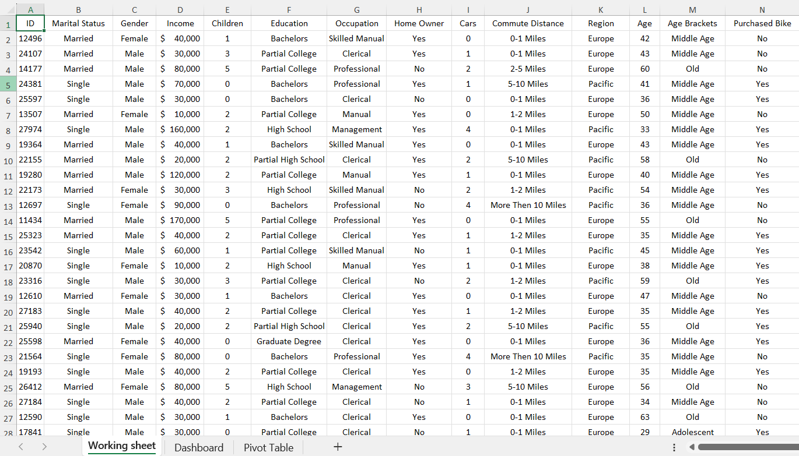
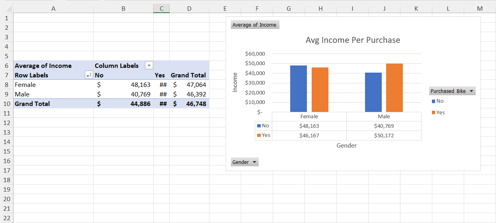
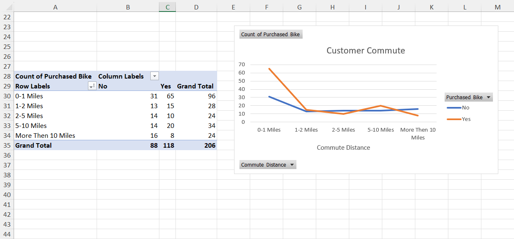
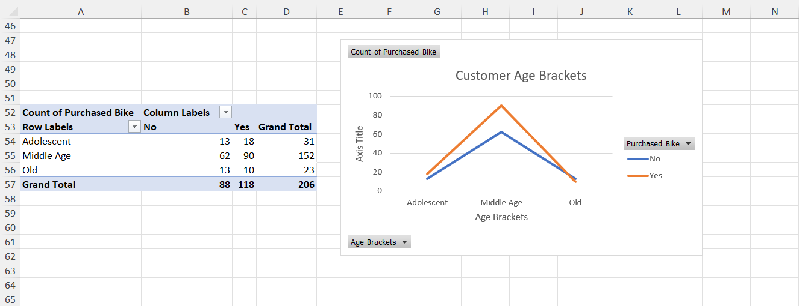

# 🚲 Bike Sales Analysis — Excel

## 📊 Project Overview

This project analyzes customer and bike purchasing data using Microsoft Excel.

As a Junior Data Analyst, I analyzed customer demographics, purchasing behavior, and sales patterns. The project demonstrates the use of data preparation, Pivot Tables, data visualization, and dashboard development to transform raw data into meaningful business insights.

## 🎯 Business Objectives

- Analyze customer demographics
- Identify patterns among bike purchasers
- Compare bike purchases across customer segments
- Analyze income and purchasing behavior
- Analyze purchasing behavior by commute distance
- Compare purchasing behavior across regions and genders
- Create an interactive dashboard to communicate key findings

## 📁 Dataset

The dataset contains 1,000 customer records with information including:

- Customer ID
- Gender
- Marital Status
- Income
- Children
- Education
- Occupation
- Home Ownership
- Number of Cars
- Commute Distance
- Region
- Age
- Age Bracket
- Purchased Bike

## 🧹 Data Preparation

The dataset was reviewed and prepared before performing the analysis.

The preparation process included:

- Reviewing the dataset structure
- Checking data consistency
- Creating calculated fields
- Creating age brackets
- Organizing categorical variables
- Preparing the data for Pivot Table analysis

### Dataset



## 📈 Pivot Table Analysis

Pivot Tables were used to summarize the dataset and identify patterns in customer purchasing behavior.

The analysis focused on:

- Bike purchases by age group
- Bike purchases by gender
- Bike purchases by commute distance
- Bike purchases by region
- Income and purchasing behavior
- Customer demographic characteristics

### Pivot Table 1



### Pivot Table 2



### Pivot Table 3



## 📊 Dashboard

An Excel dashboard was created to provide a visual overview of the analysis.

The dashboard combines charts and summarized information to make customer purchasing patterns easier to understand.


## 💡 Key Insights

The analysis identified purchasing patterns across:

- Age groups
- Gender
- Income levels
- Commute distances
- Geographic regions
- Customer demographics

These findings demonstrate how Excel can be used to transform raw customer data into meaningful business insights.

## 🛠️ Tools & Skills

### Tools

- Microsoft Excel
- GitHub

### Skills

- Data Cleaning
- Data Preparation
- Pivot Tables
- Data Analysis
- Data Visualization
- Dashboard Development
- Business Insights

## 🔄 Data Analysis Workflow

Raw Dataset  
↓  
Data Preparation  
↓  
Calculated Fields  
↓  
Pivot Tables  
↓  
Data Visualization  
↓  
Dashboard  
↓  
Business Insights

## 📂 Project Structure

```text
excel-bike-sales-analysis/
│
├── Excel Project 1.xlsx
├── README.md
│
└── screenshots/
    ├── dashboard.png
    ├── dataset.png
    ├── pivot-table1.png
    ├── pivot-table2.png
    └── pivot-table3.png
