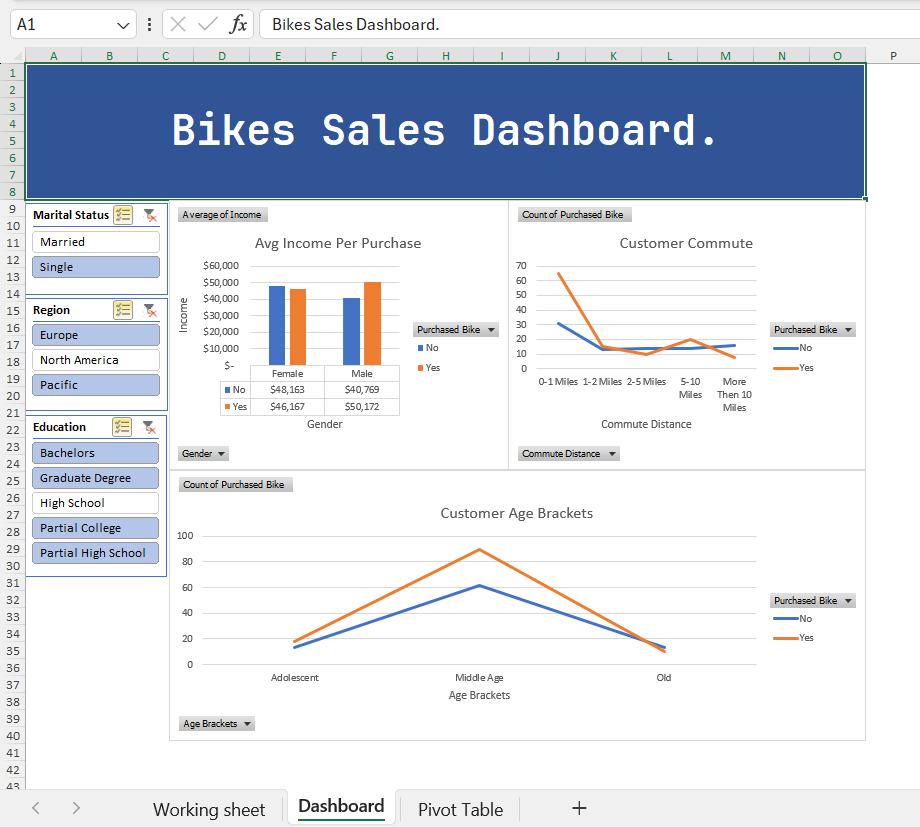

# 🚲 Bike Sales Analysis — Excel

## 📊 Project Overview

This project analyzes customer and bike purchasing data using **Microsoft Excel**.

As a **Junior Data Analyst**, I used this project to analyze customer demographics, identify purchasing patterns, and transform raw data into meaningful insights through data preparation, Pivot Tables, data visualization, and dashboard development.

---

## 🎯 Business Objectives

The main objectives of this analysis were to:

* Analyze customer demographics
* Understand bike purchasing behavior
* Identify patterns across different customer segments
* Compare purchasing behavior by gender, age, income, commute distance, and region
* Create a clear and interactive dashboard to communicate key findings

---

## 🗂️ Dataset

The dataset contains **1,000 customer records** and includes information such as:

* Customer ID
* Gender
* Marital Status
* Income
* Children
* Education
* Occupation
* Home Owner
* Cars
* Commute Distance
* Region
* Age
* Age Bracket
* Purchased Bike

---

## 🧹 Data Preparation

Before conducting the analysis, I prepared and organized the dataset to ensure it was suitable for analysis.

Key steps included:

* Reviewing the raw dataset
* Creating a dedicated working sheet
* Organizing and standardizing categorical data
* Creating an **Age Bracket** calculated field
* Preparing the dataset for Pivot Table analysis
* Checking the consistency of the data used in the analysis

---

## 📈 Analysis

I used **Excel Pivot Tables and Pivot Charts** to explore customer behavior and answer key business questions.

### Customer Demographics

* What is the distribution of customers by gender?
* Which age groups represent the largest customer segments?
* What is the average customer income?
* How are customers distributed across regions?

### Bike Purchasing Behavior

* How many customers purchased a bike?
* How does bike purchasing behavior differ by gender?
* Which age groups have the highest number of bike purchases?
* How does commute distance relate to bike purchasing?
* How does income differ between customers who purchased and did not purchase a bike?

---

## 📊 Dashboard

I created an Excel dashboard to provide a visual overview of the analysis.

The dashboard combines multiple visualizations to make the results easier to understand and communicate.

### Dashboard Preview



---

## 🧹 Data Preparation

The working dataset was organized and prepared before the analysis.


---

## 📈 Pivot Table Analysis

Pivot Tables were used to summarize the dataset and identify patterns in customer purchasing behavior.


---

## 🔍 Key Insights

The analysis explored purchasing patterns across several customer characteristics, including:

* Age groups
* Gender
* Income
* Commute distance
* Region
* Customer demographics

These analyses helped identify differences between customers who purchased a bike and those who did not.

The dashboard presents these findings in a visual format to support easier interpretation of the data.

---

## 🛠️ Tools & Skills

### Tool

* **Microsoft Excel**

### Technical Skills

* Data Cleaning
* Data Preparation
* Excel Formulas
* Pivot Tables
* Pivot Charts
* Data Visualization
* Dashboard Development
* Exploratory Data Analysis

### Analytical Skills

* Customer Segmentation
* Pattern Identification
* Business Question Analysis
* Data-Driven Insights
* Analytical Reporting

---

## 🔄 Data Analysis Workflow

```text
Raw Data
    ↓
Data Preparation
    ↓
Data Cleaning
    ↓
Exploratory Analysis
    ↓
Pivot Tables
    ↓
Data Visualization
    ↓
Dashboard
    ↓
Business Insights
```

---

## 📁 Project Structure

```text
excel-bike-sales-analysis/
│
├── Excel Project 1.xlsx
├── README.md
│
└── screenshots/
    ├── dashboard.png
    ├── data-preparation.png
    └── pivot-analysis.png
```

---

## 🚀 Professional Development

This project demonstrates my practical experience with **Microsoft Excel and fundamental Data Analytics workflows**.

As a **Junior Data Analyst**, I am developing my technical skills across:

* Microsoft Excel
* Python
* Pandas
* SQL
* Data Visualization
* Power BI

I focus on transforming raw data into structured analysis and clear, actionable insights.

---

## 👤 About Me

**Junior Data Analyst** focused on data cleaning, exploratory data analysis, visualization, and business intelligence.

I am building practical projects that demonstrate my ability to work with data, identify patterns, and communicate analytical findings clearly.

---

## 📌 Project Status

**Completed** ✅

This is one of my Data Analytics portfolio projects.
